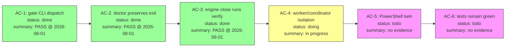

# TDAI × Engine System 深度实现规格

> 基于 TencentDB-Agent-Memory v0.3.6 源码 + engine_system v6.24.0 源码的逐行分析

---

## Part I: TDAI 核心机制精确解剖

### 1.1 Mermaid Canvas 精确格式

**元数据头:**
```
%%{ "taskGoal": "一句话目标", "progress（0-100）": "75", "createdTime": "ISO", "updatedTime": "ISO" }%%
```

**节点格式:**
```
001-N1["阶段名: 宏观动作简述<br/>status: done|doing|paused|blocked<br/>summary: 核心结论≤150字<br/>Timestamp: ISO8601"]
```

**状态编码:** 不在 CSS class 里，在节点 label 文本内。解析正则: `/status:\s*(done|doing|todo|paused|blocked)/gi`

**node_id 模式:** `{3位前缀}-N{序号}`，如 `001-N3`。前缀对应 MMD 文件编号。

**更新机制:** LLM 输出 JSON:
```json
{
  "file_action": "replace",
  "replace_blocks": [{"start_line": 5, "end_line": 7, "content": "..."}],
  "node_mapping": {"tool_call_id_1": "001-N1"}
}
```

**patchMmd 算法:** 按 startLine 降序排列 blocks → 从后往前 splice → 避免索引偏移。`endLine < startLine` = 纯插入。

**变更检测指纹:** `"{content.length}:{content.slice(0,64)}"` — 轻量级，每次 tool loop tick 检查。

**注入位置算法:**
1. 找最新 user message 索引
2. 如果在后半段 → 插在其后（user 问题和 tool loop 之间）
3. 否则从尾部向前扫描 toolResult/assistant 块起点，clamp 到距尾 30 条
4. 永远不拆分 tool_call/tool_result 对（向前调整）

**History MMD:** aggressive 删除后，收集被删消息的 tool_call_id → 反查 offload map 得到 MMD 前缀 → 注入对应历史 MMD（full → meta-only → skip，预算 = 20% context window）。

---

### 1.2 三级压缩精确算法

**MILD (score-cascade replacement):**
- 扫描前 70% 消息中的 tool_result
- 按 offload entry 的 score 降序排列（7→1 级联）
- 用 L1 摘要替换原文（如果摘要比原文大则跳过）
- 替换后格式: `[Offloaded Tool Result | node: 001-N3]\nSummary: ...\nresult_ref: refs/xxx.md`
- 最少替换 10 条后停止

**AGGRESSIVE (one-shot head deletion):**
- 提取 MMD 消息（保护不删）
- 计算需删除 token 数 = remaining - aggressiveThreshold
- 从头部累加直到满足 → 得到 deleteCount
- 调整: 不拆 tool pair（向后扩展）+ 不删最后 user message（向前截断）
- 最低保证: 至少删 20% 消息数（防止头部全是小摘要时进度不足）
- 一次 splice 完成

**EMERGENCY (multi-strategy loop):**
- 循环直到 tokens <= 60% context 或只剩 2 条消息
- Strategy A: 比例头删（excess ratio，最大 50%）
- Strategy B: 尾删（找最大 tool pair group 整组删除）
- Strategy C: 截断最大消息（>600 token 的非 user 消息，替换为 stub）
- 全部失败 → break（truly stuck）

**Token 计数三层:**
1. Quick-skip: CJK 1.5 tok/char + Latin 0.25 tok/char，< 85% mild 阈值时跳过（最多连续 5 次）
2. Fast estimate: 预计算 CJK lookup table，~5ms/100K chars，误差 2-7%
3. Precise tiktoken: WeakMap 缓存 per-message，内部 metadata keys 序列化前剥离

---

### 1.3 Pipeline 调度精确逻辑

**L1 触发:**
- 阈值路径: conversation_count >= effectiveThreshold（warm-up: 1→2→4→8→N→graduated）
- 空闲路径: 可重置定时器，默认 60s 无活动
- 关闭路径: flush all

**L2 定时器（downward-only 语义）:**
- `tryAdvanceTo(desiredTime)` — 只能提前，不能推后
- desiredTime = max(now + delayAfterL1, lastL2 + minInterval)
- 完成后 arm maxInterval 无条件定时器
- 冷会话（>24h 不活跃）不重新 arm

**L3 (persona):** 全局互斥 + pending flag 去重。运行中再触发 → 设 pending → 完成后再跑一次。

**Checkpoint 原子性:** promise-chain 文件锁 + tmp+rename 原子写。`captureAtomically` 在同一个 mutate 闭包内读游标→执行→推进游标，消除竞态。

---

### 1.4 L1.5 任务边界判断

**三步推理链（LLM 驱动）:**
1. 意图提取: 用户消息分类为 继续/完工/闲聊/新需求
2. 基线对齐: 意图 vs 当前 MMD 的 taskGoal + node 状态
3. 延续搜索: 扫描最近 10 个历史 MMD 的 taskGoal，判断是否为延续

**输出:**
```typescript
{ taskCompleted, isLongTask, isContinuation, continuationMmdFile?, newTaskLabel? }
```

**边界标记:** `{ startIndex, result: "long"|"short"|"pending", targetMmd }` — 将 offload entry 流按任务归属分段。

**任务切换动作:** 创建新 MMD / 重激活历史 MMD / 清除 active MMD / 强制 L2 flush 残留 null entries。

---

## Part II: Engine System 精确格式参考

### 2.1 SessionStart 注入顺序

```
L0 Constitution (40行) → GLOSSARY提示 → CONTEXT.md (50行) → HANDOFF (4行表格)
→ Domain Dashboard → Active Task Card (全文,≤3张) → Coordinator/Worker 状态
→ AC Checkpoint → progress.md → L2 Domain (CONTEXT 50行 + PITFALLS 40行)
→ Pending Decisions → Pending from Previous → Update Available
```

### 2.2 Guard 模式输出

```
[Engine Guard] ACTIVE: T-028, T-029 | Re-check before writing.
T-028 GOAL: [前200字符]
BOUNDARY: write only inside YOUR card's WRITE-SET...
PARALLEL: each session drives its own card...
```

### 2.3 Evidence JSON (v6.18.0+)

```json
{
  "ac": "AC-1", "verify": "<原始命令>", "execution_command": "<实际执行>",
  "status": "pass|fail|blocked", "exit": 0,
  "output_fingerprint": "sha256:...", "code_fingerprint": {"file": "blob-sha"},
  "write_set_snapshot": [...], "verified_against_commit": "HEAD-sha",
  "write_provenance": {"writer":"engine-verify","commit":"...","timestamp":"...","argv":"..."}
}
```

### 2.4 Doctor Check 模式

```bash
check_<name>() {
  # guard → cv解析 → 迭代检查 → fail/warn/pass
}
# 底部顺序调用，无注册表
# 扩展点: engine/checks/check-*.sh (非零=FAIL) / warn-*.sh (非零=WARN)
```

### 2.5 Task Card 格式

```markdown
# T-NNN: 标题
> status: active|paused|done
> lane: main
> decision: D-NNN
> domain: engine-runtime,project-meta

## GOAL
## WRITE-SET
## FORBIDDEN
## AC
AC: AC-1 描述 | verify: 命令
```

### 2.6 progress.md 7 栏

```
§1 已读文件 | §2 已确认接口 | §3 已排除路径 | §4 当前进行到
§5 待确认问题 | §6 已知风险 | §7 回滚尝试
```

---

## Part III: 集成实现规格

### 3.1 P0-A: Mermaid 任务状态画布（engine-canvas.sh）

**核心设计决策: 无状态，读时生成。** 不写文件到 engine/，每次 SessionStart/guard 从 evidence 目录实时派生。

**数据源:**
- `engine/tasks/T-NNN.md` → AC 列表（4 种声明格式，复用 engine-verify 的解析器）
- `engine/evidence/T-NNN/AC-N.json` → status 字段 → 节点状态
- `engine/evidence/T-NNN/GATE.json` → 整体 pass/block → 画布完成态
- Task card `status:` 字段 → active/done

**状态映射:**
| Evidence 状态 | 节点状态 | 颜色 |
|---|---|---|
| 无 AC-N.json | todo | 紫 #f9f |
| `"status":"pass"` | done | 绿 #9f9 |
| `"status":"fail"` | blocked | 红 #f99 |
| `"status":"blocked"` | blocked | 红 #f99 |
| 第一个 todo（前面全是 done） | doing（推断） | 黄 #ff9 |

**输出示例:**


**注入点:** SessionStart 中 Active Task Card 之后、Checkpoint 之前。Guard 模式只输出一行: `CANVAS: T-079 3/6 AC PASS`。

**刷新触发:** `engine verify` 写 AC-N.json → 下次 guard/SessionStart 自动读到新状态。无缓存，无同步问题。

**>8 AC 时:** 切换为 `graph TD`（纵向），避免横向溢出。

**与 TDAI 的关键差异:**
- TDAI: LLM 驱动节点创建和状态转换，持久化为 .mmd 文件
- Engine: 纯证据派生，无 LLM，无持久化（view not state）
- 共同点: 都是 Mermaid flowchart，都用 status 标记，都注入 agent context

---

### 3.2 P0-B: 失败模式自动提取

**18 个可观测信号（全部零 LLM）:**

| 信号 | 检测源 | 检测方式 |
|------|--------|----------|
| S1 writeset-block | Stop hook 自身 | block reason 含 "outside the WRITE-SET" |
| S5 memory-writeback | Stop hook 自身 | code_changed=1 && engine_written=0 |
| S6-S11 precommit-* | `.cache/last-commit-block` | pre-commit 失败时写 2 行文件 |
| S12 verify-fail | evidence/*.json | grep `"status":"fail"` |
| S13 doctor-fail | `.cache/session-end-doctor.log` | grep `^FAIL` |
| S14 budget-exceeded | 同上 | grep "exceeds.*budget" |
| S15 repeated-edit | paths ledger + git diff | 同文件 >5 hunks |
| S18 capsule-missing | Stop hook 自身 | capsule_written=0 |

**去重算法:**
```
dedup_key = sha256(signal_id + "|" + glob_normalize(path) + "|" + domain)[0:12]
glob_normalize: T-077→T-*, 保留前2级目录+扩展名
```
检查位置: PITFALLS.md 全文 + `.cache/seen-keys`（已 discard 的 key）

**候选格式:**
```markdown
- **CAND-001** WRITE-SET 未覆盖新文件导致 Stop 拦截
  - signal: S1
  - path: src/utils/new-helper.ts
  - task: T-052
  - domain: project-meta
  - session: ec3dfb2a
  - date: 2026-07-27T10:32:00Z
  - detail: [2-3句机械描述]
  - dedup-key: a3f7c2e91b04
  - status: pending
```

**生命周期:** Stop hook 自动追加 → pending → 人工 promote(分配 P-NNN) 或 discard → Doctor 30天 WARN / 60天建议 discard

**集成点:** Stop hook 末尾，`exit 0` 之前，`|| true` 包裹（fail-open）。

**pre-commit 配套改动:** 每个 `exit 1` 点前加:
```bash
printf '%s\n%s\n' "$signal_id" "$trigger_file" > "$ENGINE_DIR/.cache/last-commit-block"
```

---

### 3.3 P1-A: 任务漂移检测器（guard 扩展）

**4 个信号，纯 shell，<50ms:**

| 信号 | 权重 | 检测 |
|------|------|------|
| prompt 提到非 active 的 T-NNN | +3 | grep -oE 'T-[0-9]{3}' 对比 guard_ids |
| prompt 与 GOAL 零关键词重叠 | +2 | bag-of-words（≥4字符词）交集=0 |
| session-card 亲和性不匹配 | +1 | `.cache/sessions/<key>.card` vs guard_ids |
| active card mtime >4h | +1 | stat 比较 |

**输出（仅建议，不阻断）:**
- score >= 3: `[Engine Guard] DRIFT ADVISORY (score=N): reasons...`
- score 1-2: `[Engine Guard] drift-hint: reasons...`
- score 0: 静默

**新增文件:** `.cache/sessions/<key>.card`（PreToolUse 成功写入后记录 governing card ID）

**HANDOFF 扩展:** 新增 `任务边界` 列:
```
T-077→done,T-078→active;trigger=explicit-close,confidence=explicit,boundary-index=a3f2c1d
```

**机器可读伴侣:** `.cache/boundaries.jsonl`（append-only）:
```json
{"ts":"...","session":"...","from":"T-077","to":"T-078","trigger":"explicit-close","confidence":"explicit","commit":"a3f2c1d","residual_entries":0}
```

---

### 3.4 P1-B: 变更胶囊演进（heat + META）

**当前格式:** 8 个 section 的扁平一次性记录。

**扩展:** 在文件顶部增加 META header（借鉴 TDAI scene block）:
```markdown
-----META-START-----
created: 2026-07-14T10:00:00Z
updated: 2026-08-01T14:30:00Z
heat: 3
related-decisions: D-024, D-031
related-tasks: T-028, T-035, T-042
domain: engine-runtime
-----META-END-----
```

**Heat 语义:**
- 新建 = 1
- 同域新 task done 且影响范围重叠 → heat+1（Doctor 检查时更新）
- MERGE（两个胶囊合并）= sum+1

**Doctor 新 check:**
```bash
check_capsule_heat() {
  # heat >= 5 的胶囊 → WARN "高频变更区域，考虑提取为正式决策或 PITFALLS"
  # heat >= 3 且 related-decisions 为空 → WARN "多次变更无决策记录"
}
```

**演进轨迹 section（新增第 9 section）:**
```markdown
## Evolution
- 2026-07-14: T-028 初始创建（安装器 SHA256 校验）
- 2026-07-20: T-035 追加（--local 模式 manifest 路径修复）
- 2026-08-01: T-042 追加（plugin 镜像同步遗漏）
```

---

### 3.5 P2-A: BM25 语义 Read-Gate

**目标:** agent 描述意图 → 系统返回相关规则/陷阱/决策。

**索引源:**
- `contract/dist/*.md`（契约规则）
- `engine/domains/*/PITFALLS.md`（陷阱）
- `engine/decisions/D-*.md`（决策）
- `engine/tasks/T-*.md` 的 GOAL 段（历史任务）

**实现:** 纯 bash + grep（不需要 embedding）:
```bash
engine query "编译流程" → grep -ril "编译\|compile\|compile.sh" 上述文件 → 按匹配行数排序 → 输出 top-5 摘要
```

**为什么不需要 vector:** 引擎术语是确定性的（"WRITE-SET"、"verify"、"gate"、"compile"），不是自然语言模糊查询。BM25 的 keyword matching 完全覆盖。

**集成:** `engine context --query "..."` 或 `engine query "..."` 新子命令。

---

### 3.6 P2-B: 项目画像（PROFILE.md）

**触发:** 每次 task card 标记 done 时（Stop hook 检测 status 变更）。

**合成源:** 最近 N 个 done 卡的 GOAL + 决策引用 + PITFALLS 条目。

**格式（借鉴 TDAI persona 四层深扫）:**
```markdown
# PROJECT PROFILE — engine_system

## 架构风格
纯 bash + markdown，零运行时依赖，git-native。契约编译制（contract/src → dist）。

## 技术债分布
- engine-runtime: PS1 孪生 drift（非核心功能落后）
- project-meta: 测试命名不统一（5 个独立 runner）

## 高风险区域
- pre-commit hook: glob 展开陷阱、protected paths Layer 2
- compile.sh: SYNC_LIST 遗漏 → 发布时文件缺失

## 团队约定
- 受保护路径提交: git -c core.hooksPath=nul（用户已授权）
- 小型 bug fix: --no-verify 绕过（不立新卡）
- 架构决策: 当场拍板，全量实施，不做试点
```

**更新协议（增量，借鉴 TDAI incremental persona）:**
- 新 done 卡 GOAL 与现有画像对比 → strengthen / supplement / correct / no-change
- 频率极低（每个 task done 才触发），可以用 LLM

---

## Part IV: 不集成的精确理由

| TDAI 特性 | 不集成原因（精确） |
|-----------|-------------------|
| sqlite-vec / embedding | Engine 知识是确定性术语（WRITE-SET、verify、gate），grep 即可。引入 DB 违背"纯文件 + git"产品定位。部署复杂度从 0 跳到需要 native module 编译。 |
| LLM 驱动 L1 提取 | Engine 的 agent 本身就是 LLM。TDAI 需要外挂 pipeline 是因为 host agent 不感知记忆系统。Engine 的 write-back 机制（Stop hook 强制更新 CONTEXT）已经让 agent 自己判断什么值得记录。 |
| Gateway HTTP 服务 | Engine 是无状态脚本系统（每次调用独立进程）。引入常驻进程需要进程管理、端口冲突处理、健康检查——全部是 engine 当前不需要的复杂度。 |
| tiktoken 精确计数 | Engine 预算是行数/字节（契约编译 2896/2940 行）。Host 的 context compaction 是黑盒，engine 无法控制也无需控制。guard 模式的重锚定已经解决了规则被挤出的问题。 |
| RRF 融合排序 | 只有 keyword 检索（无 embedding），不需要融合。单通道 BM25 足够。 |
| L1.5 LLM 判断 | 用 4 信号启发式替代（Part III 3.3）。Engine 的 no-LLM-in-hooks 约束是产品决策（fail-open、零延迟、零成本）。 |

---

## Part V: 实施路线图

```
Phase 1 (P0, 1-2 天):
  ├── engine-canvas.sh 脚本（~120行 bash）
  ├── SessionStart hook 注入点（~15行）
  ├── Guard 模式一行摘要（~5行）
  └── 验证: 对 T-077/T-078/T-079 生成画布，确认状态正确

Phase 2 (P0, 1-2 天):
  ├── Stop hook extract_failure_patterns()（~80行）
  ├── pre-commit last-commit-block 写入（每 exit 1 点 2 行）
  ├── PITFALLS.md "## 待审陷阱" section 初始化
  ├── Doctor check_pending_pitfalls（~20行）
  └── 验证: 模拟 WRITE-SET 违规 → 检查候选生成 + 去重

Phase 3 (P1, 2-3 天):
  ├── Guard drift detection 扩展（~40行）
  ├── .cache/sessions/<key>.card 写入（PreToolUse 1 行）
  ├── boundaries.jsonl 追加逻辑
  ├── HANDOFF 表格扩展
  └── 验证: 模拟跨任务 prompt → 检查 advisory 输出

Phase 4 (P1, 1 天):
  ├── 变更胶囊 META header 模板
  ├── Doctor check_capsule_heat
  └── 验证: 对现有胶囊补充 META

Phase 5 (P2, 3-5 天):
  ├── engine query 子命令
  ├── PROFILE.md 合成逻辑
  └── 验证: 端到端冒烟
```
